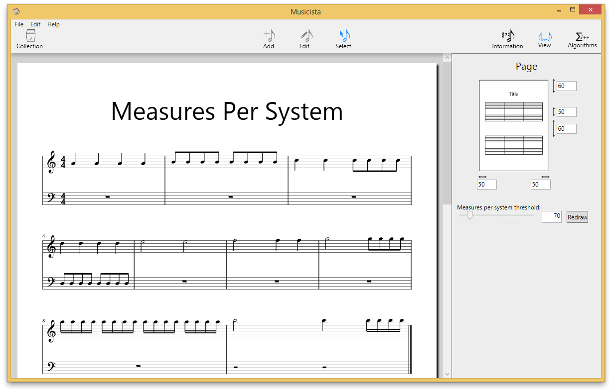

+++
Title = "Automatic system-break"
+++

# Automatic system-break

Up to now, Musicista fit a fixed amount of four measures (or, to be precisely, measure groups) into one system. Today, this has changed: 

There now is a slider to influence, how many measures are put into one system. How does it work? As opposed to most other programs, Musicista spaces notes in mathematical proportion, i.e. a quarter is double as wide as an eight, an eight has double the width of a sixteenth and so on. These widths however are relative to the width of the measure, which itself depends on how many measures fit into one system. This is the tricky thing: The measure-count is the one given thing everything else depends on. So how can you calculate, how many measures fit?

Fitting mostly depends on the kind of notes that are present in the measures. Half notes have a lot of space, which is not necessarily needed, whereas sixteenths follow each other very closely. They need a wider measure. The chosen approach is to calculate a density-score: The algorithm counts groups of note, multiplies them with a factor and adds up these factors. In the above screenshot we have four quarter notes, which give the measure a density-score of 4 * 2 = 8. The next measure has eight eigths, which makes 8 * 4 = 32. The next one is mixed: 2 * 2 + 4 * 4 = 20. The highest possible score is 96, as seen in measure 8 with 16 sixteenths.

Now that each measure has a score (in the example 8, 32, 20, 32, 4, 6, 18, 128, 36) they need to be grouped into systems. This is done by adding up the density-scores until the threshold (which the user can alter) is reached. The algorithm adds an increasing amount of points for each measure as well, to limit their amount. Also, no matter how high the score is, there have to be at least to measures for one system. In the example the measures are grouped into

- (8, 32, 20, 32, 4) + 1 + 2 + 3 + 4 + 5 = 60 + 15 = 75,
- (6, 18, 96, 28) + 1 + 2 + 3 + 4 = 60 + 10 = 70 and
- (128, 36) + 1 + 2 = 167.

This is a very basic algorithm, which works in most cases, but might fail in some. For example imagine measure with a double-dotted half and two sixteenths. There will be a lot of space for the half note and the sixteenths will be very close. This is why the threshold is not fixed but can be adjusted by the user. Also, the grouping is stored in the musicista-file and can be corrected by hand.