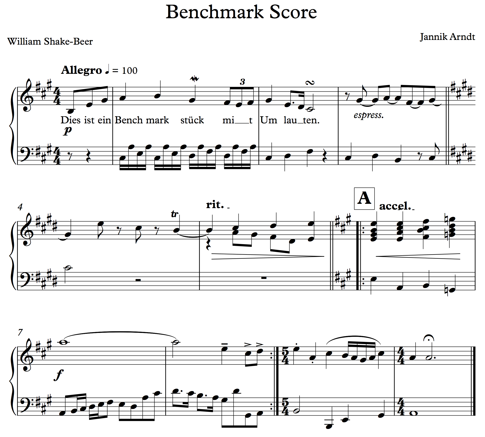
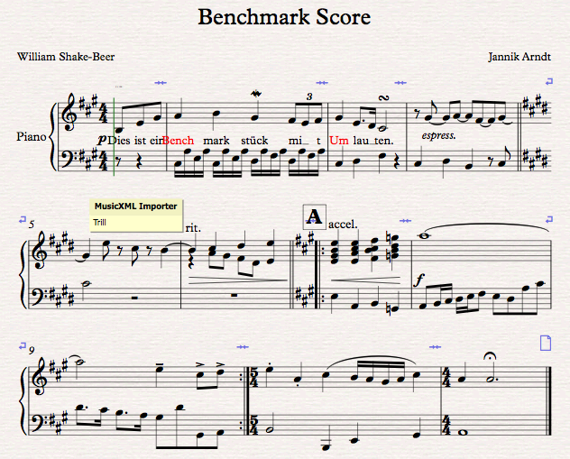
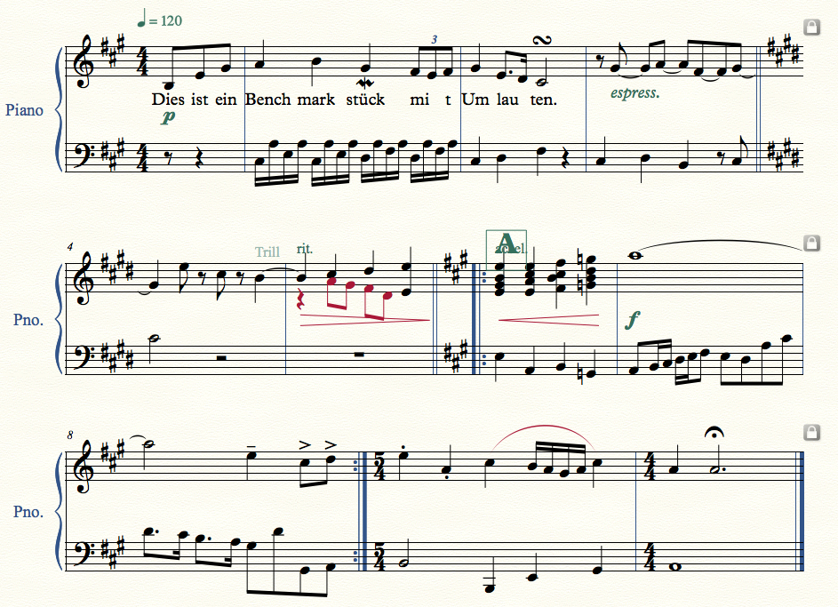
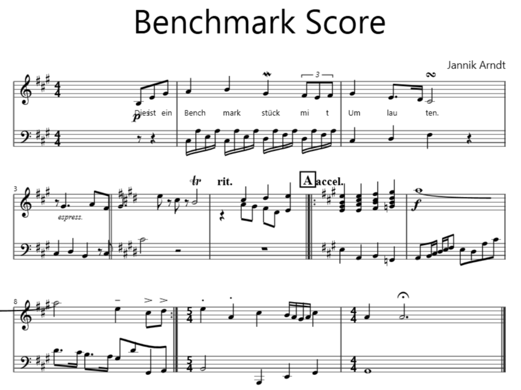

+++
Title = "Scorewriter Benchmarks"
+++

# Scorewriter Benchmarks

Evaluating the output of a scorewriter is not easy. Mostly because there are no compulsory rules that anyone has to keep to. There is the 676-page-guide *Behind Bars — The Definitive Guide to Music Notation* by Elaine Gould, which is a wonderful reference, but still not complete and in now way easy transformable into algorithms.

Now displaying html- css- and javascript-content on a webpage is in a way similar to musical notation, at least in its liberties. Browsers are tested with example-code, like the acid-test. Inspired by this test I created a benchmark score that uses all common pitfalls in notation. Here is a complete list:

### General layout

- Pickup measure
- Time signature changes
- Key changes
- Tempo text with metronome mark
- Barlines (Single, Double, Repeat, Final)
- Rehearsal marks
- Lyrics
- Meta information: Title, Composer, Lyricist

### Notation

- Sixteenths (beamed), Eigths (single and beamed), Quarters, Halves, Whole notes
- Triplets
- Tied notes (in measure and between measures)
- Chords
- Multiple voices
- Notes longer than one measure
- Accidentals
- Dotted notes


### Articulation

- Slur
- Staccato, Tenuto, Accent
- Fermata
- Trill, Mordent, Turn
- Ritardando, Accelerando
- Crescendo (wedge)
- Dynamics
- Free text (“espress.”)


I engraved the piece by hand in Sibelius as beautiful as the software was able to. The desired result looks like this:

<center></center>

Then I exported the score to MusicXML and imported that back into Sibelius 7:

<center></center>

Probably the most astonishing thing is the trill, which is not recognized on import, although the file was written by the exact same software. I also tried Finale 2014:

<center></center>

Here too quite a few corrections by hand would be necessary. Note that the red notes in measure 5 denote a second voice, not an error. Let's see what MuseScore 1.3 displays:

The Benchmark Score in MuseScore
The Benchmark Score in MuseScore
Again, not that beautiful. Especially the system breaks throw me off. But as I wrote, they are difficult to calculate. Neither Finale nor MuseScore got the title, composer and lyricist right, although the source clearly states them:

```xml
    <score-partwise version="3.0">
     <work>
     <work-title>Benchmark Score</work-title>
     </work>
     <identification>
     <creator type="composer">Jannik Arndt</creator>
     <creator type="lyricist">William Shake-Beer</creator>
    …
```
Now finally for the Musicista (v0.8) result:

<center></center>

Well, there are a few spots that still need correction, but all in all I am a bit proud.